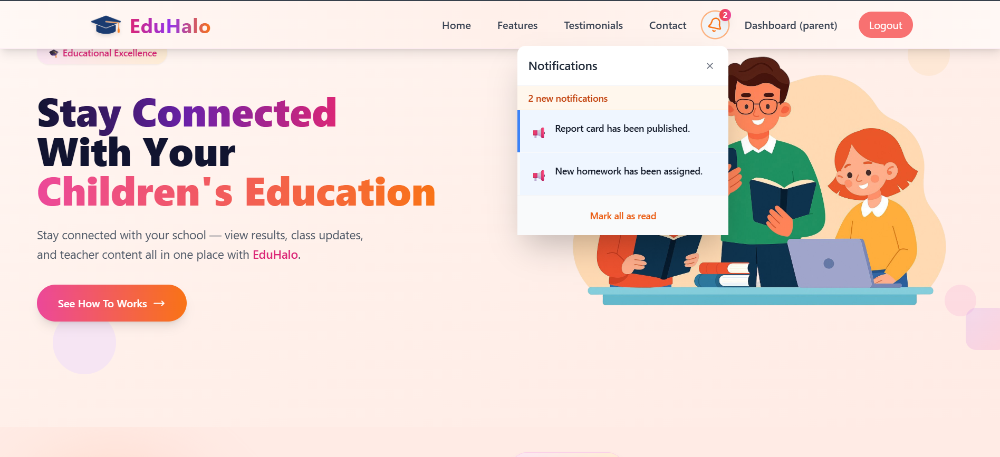
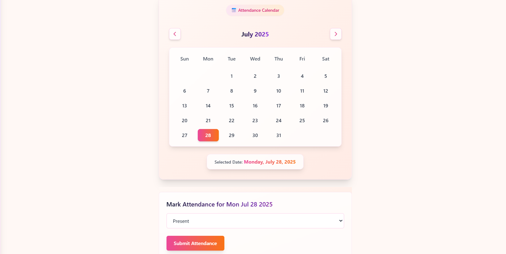
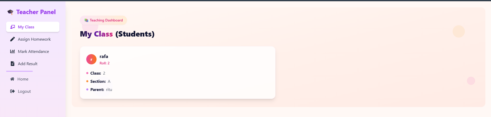
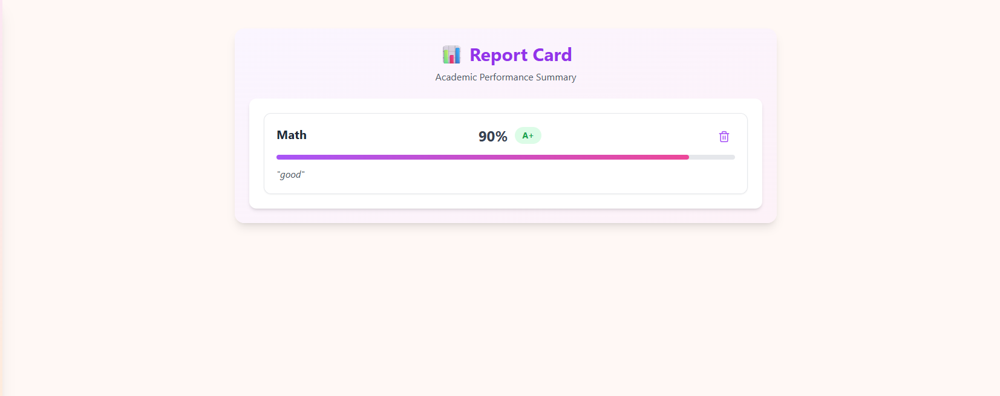

🏫 EduHalo – Intelligent School Management System


<p align="center">
  
</p>

---
## 📘 About

**EduHalo** is an intelligent and modern school management system built using the **MERN Stack** and **GraphQL**. The platform empowers **admins**, **teachers**, and **parents** to stay connected through a centralized and interactive system.

- Admins can manage teachers, parents, and student assignments.
- Teachers can upload homework, track attendance, and publish results.
- Parents can monitor their child’s academic progress in real-time.

---

## 🚀 Features

-  *Role-based Access**: Admin, Teacher, and Parent dashboards.
-  **Teacher Tools**: Attendance tracking, homework uploads, result publishing.
-  **Parent Dashboard**: View child’s performance, attendance, and tasks.
-  **GraphQL API**: Optimized querying and mutation support.
-  **Responsive Design**: Works across all devices.

## 🛠️ Tech Stack

<p align="center">
  
  
  
  
  
  
</p>

---


###  Installation

1. **Clone the repository**
```
git clone https://github.com/your-username/eduhalo.git
```

2. **Navigate to project directory**
```
cd eduhalo
```


3. **Install dependencies**
```
npm install
```
  
```
yarn install
```

4. **Start development server**
``` 
npm run dev
```
 
```
yarn dev
```

5. **Open your browser**
 ```
 Navigate to http://localhost:5173
 ```

---


<p align="center">
  
</p>
<p align="center">
  
</p>
<p align="center">
  
</p>


## 🎯 How to Use

### Step 1: 🏠 **Get Started**
Open the EduHalo application in your browser and log in using your assigned role credentials (Admin, Teacher, or Parent).

### Step 2: 🔐 **Role-Based Access**
Use the intuitive interface to access role-specific dashboards:
- **Admin**: Add/manage teachers, parents, and students; assign users to classes.
- **Teacher**: Mark attendance, upload homework, and publish student results.
- **Parent**: View your child's performance, attendance, homework, and grades.

### Step 3: 🧭 **Navigate the System**
- Explore your dashboard with role-specific options.
- Access detailed student, class, and performance data.
- Responsive design ensures seamless access on desktop, tablet, or mobile.

### Step 4: 📊 **Manage & Monitor**
- Admins and Teachers manage data using smart forms and interactive panels.
- Parents stay informed with real-time updates about their child’s academic progress.
- All user actions are powered by a smooth GraphQL backend for optimal performance.

---


## 🤝 Contributing

We welcome contributions from the community! Here's how you can help make SkillSync even better:

### 🔧 **Development Setup**

1. **Fork the repository**
   ```
   git fork https://github.com/your-username/eduhalo.git
   ```

2. **Create a feature branch**
   ```
   git checkout -b feature/your-feature-name
   ```


3. **Commit your changes**
   ```
   git commit -m "feat: your message"
   ```

4. **Push to your fork**
   ```
   git push origin feature/your-feature-name
   ```

5. **Open a Pull Request**
   - Provide a clear description of changes
   - Include screenshots if applicable
   - Reference any related issues

### 🐛 **Found a Bug?**
- Check existing issues first
- Create a detailed bug report
- Include steps to reproduce


## 🌟 Show Your Support

If you find SkillSync helpful, please consider:
- ⭐ Starring the repository
- 🍴 Forking the project
- 📢 Sharing with friends and colleagues
- 💬 Providing feedback and suggestions

---

## 📄 License

This project is licensed under the MIT License - see the [LICENSE](LICENSE) file for details.

---


